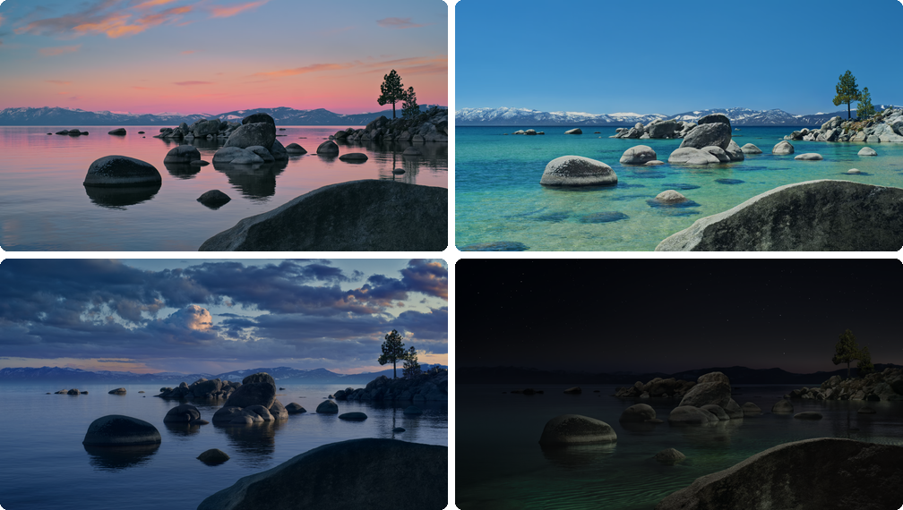

# Solar Wallpaper

A macOS dynamic wallpaper system that automatically transitions between Lake Tahoe aerial wallpapers based on the sun's position in the sky. Transitions are smooth and imperceptible — pre-blended intermediate frames step through at 1-minute intervals using macOS's native `NSWorkspace.setDesktopImageURL` API.

<p align="center">
  
</p>

<p align="center">
  
</p>

## How It Works

### Scheduled Transitions

A launch agent fires the script at each transition time:

| Time | Transition |
|------|-----------|
| 3:00am | Recalculates sunrise for the new day and updates the schedule |
| Sunrise | night → morning (calculated daily based on location) |
| 12:00pm | morning → day |
| 7:00pm | day → evening |
| 11:00pm | evening → night |

When a transition triggers, the script steps through 30 pre-blended intermediate frames over 30 minutes (one per minute). Each step is a ~3% opacity change — imperceptible individually, smooth in aggregate. The wallpaper is set via `NSWorkspace.setDesktopImageURL`, so macOS persists it natively through sleep, login, and reboot.

### Wake / Lid-Open

When you open the laptop after it's been closed:

1. macOS shows the **previous wallpaper** (already persisted from the last `setDesktopImageURL` call)
2. The screen watcher daemon detects wake and triggers the script
3. The script calculates the correct current period and does a **5-second rapid fade** from the previous wallpaper to the current one (stepping through the same intermediate frames quickly)

If you wake mid-transition (e.g., the evening fade started at 19:00, you closed at 19:10, reopened at 19:20), the script calculates which frame corresponds to 19:20 and resumes from there — no jump, no flash.

### Why This Approach

Previous iterations used a Core Animation overlay window for real-time GPU crossfades. This was fragile:
- The overlay process could die on sleep/wake
- It required a window server session (unavailable during wake)
- The overlay appearing was itself a visual discontinuity
- `setDesktopImageURL` inside the overlay fired before the crossfade rendered, causing abrupt snaps

The pre-blended frame approach eliminates the entire class of overlay bugs. There is no transient process that can die. The script is idempotent — it always does the right thing based on wall-clock time, regardless of when or how it was launched.

## Setup

### Prerequisites

- macOS with Tahoe wallpaper aerials downloaded (System Settings → Wallpaper → Tahoe)
- `ffmpeg` installed (`brew install ffmpeg`) for initial frame extraction
- Swift compiler (included with Xcode or Command Line Tools)
- Python 3 with Pillow and NumPy (`pip3 install Pillow numpy`)

### Install

```bash
# Clone
git clone https://github.com/interfaceconjurer/solar-wallpaper.git ~/git-repos/solar-wallpaper
cd ~/git-repos/solar-wallpaper

# Compile the wallpaper-setting binary and screen watcher
swiftc -O -o set_wallpaper set_wallpaper.swift -framework Cocoa
swiftc -O -o screen_watcher screen_watcher.swift -framework Cocoa

# Extract base frames from the aerial videos (first run only)
python3 solar_wallpaper.py

# Generate transition frames (~94 MB, one-time)
python3 generate_frames.py

# Calculate sunrise and install the launch agent schedule
python3 solar_wallpaper.py --schedule
```

### Configuration

Location is auto-detected on first run and cached in `config.json`. To set it manually:

```json
{
  "latitude": 38.9687,
  "longitude": -77.3411
}
```

### Commands

```bash
# Normal run — transitions if the period has changed
python3 solar_wallpaper.py

# Force a specific period immediately
python3 solar_wallpaper.py --hard-switch morning

# Recalculate sunrise and update the launchd schedule
python3 solar_wallpaper.py --schedule

# Regenerate transition frames (after changing STEPS or quality)
python3 generate_frames.py
```

## Architecture

```
┌──────────────────────────────────────────────────────────┐
│ launchd (com.jwright.solar-wallpaper)                     │
│ Fires at: sunrise, 12:00, 19:00, 23:00, 03:00           │
│ RunAtLoad: yes                                           │
└────────────────────────┬─────────────────────────────────┘
                         │ launches
                         ▼
┌──────────────────────────────────────────────────────────┐
│ solar_wallpaper.py                                        │
│ • Determines current period from sun elevation / clock    │
│ • Reads .last_period to know what's currently displayed   │
│ • Steps through transitions/X_to_Y/00-29.jpg frames      │
│ • Calls set_wallpaper binary for each frame               │
│ • Wall-clock anchored: handles sleep/resume naturally     │
└────────────────────────┬─────────────────────────────────┘
                         │ subprocess
                         ▼
┌──────────────────────────────────────────────────────────┐
│ set_wallpaper (Swift binary)                              │
│ • Calls NSWorkspace.setDesktopImageURL for all screens    │
│ • macOS persists this through sleep/login/reboot          │
└──────────────────────────────────────────────────────────┘

┌──────────────────────────────────────────────────────────┐
│ screen_watcher (Swift daemon, launchd KeepAlive)          │
│ • Listens: didWakeNotification, screenIsUnlocked,         │
│   didChangeScreenParametersNotification                   │
│ • On wake: triggers solar_wallpaper.py (handles catch-up) │
│ • On display connect: applies current wallpaper directly  │
└──────────────────────────────────────────────────────────┘
```

## Files

| File | Purpose |
|------|---------|
| `solar_wallpaper.py` | Main script — determines period, steps through frames |
| `set_wallpaper.swift` | Minimal binary to call `setDesktopImageURL` |
| `screen_watcher.swift` | Wake/display-connect daemon |
| `generate_frames.py` | Pre-renders blended transition frames |

| `frames/` | Base t=0 PNG frames from each aerial video |
| `transitions/` | Pre-blended intermediate JPEG frames |
| `config.json` | Latitude/longitude (auto-generated) |
| `.last_period` | Current period state file |
